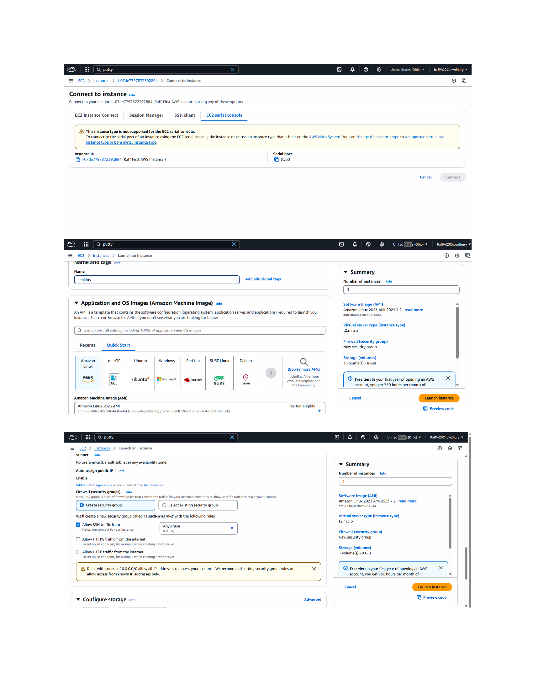
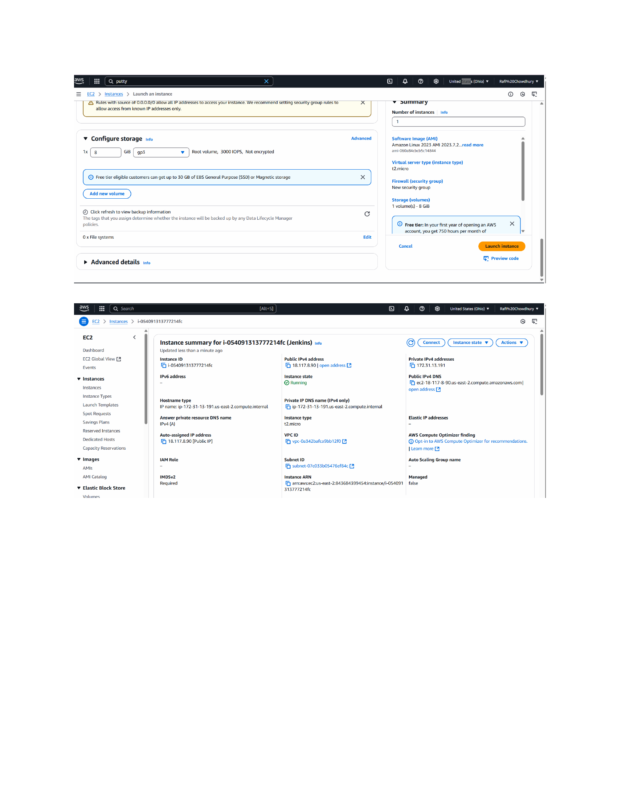
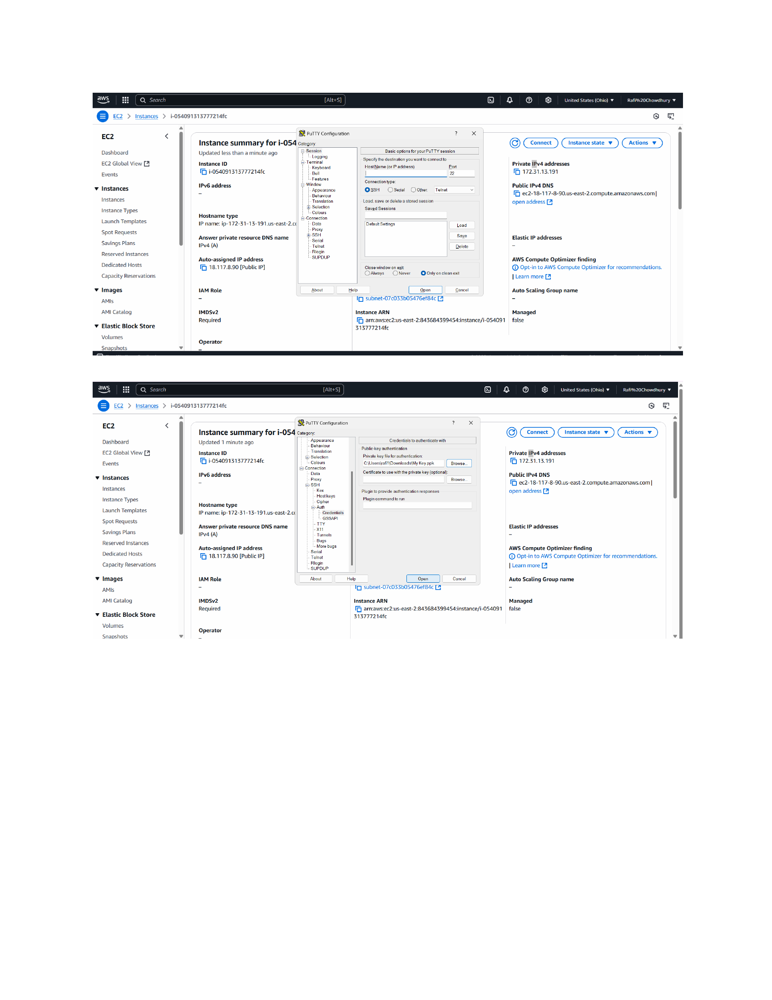

# Deploying Jenkins on an Amazon EC2 Instance (Beginner-Friendly Walkthrough)

This project demonstrates how I deployed Jenkins on an Amazon EC2 instance using PuTTY. I’ll walk you through exactly what I did, step by step, using screenshots, and explain everything in simple, beginner-friendly language. I used this project to better understand IAM concepts in a cloud environment, and I now use it to showcase my technical hands-on experience in interviews.

---

## Step 1: Launch an EC2 Instance on AWS

**What I Did:**  
I logged into my AWS account, went to the EC2 dashboard, and launched a new instance. I selected the **Amazon Linux 2 AMI** (free tier eligible), which is a stable and lightweight OS that works well with Jenkins.

I chose the `t2.micro` instance type because it qualifies for the free tier and is enough for testing Jenkins.

**Screenshot:**  


**Why This Matters:**  
You need a server (in this case, an EC2 instance) to host Jenkins. This is where your Jenkins service will live and run.

---

## Step 2: Configure Security Group

**What I Did:**  
While setting up the instance, I created a **new security group** that allowed:
- **SSH (port 22)** so I could connect remotely using PuTTY.
- **HTTP (port 80)** so Jenkins could be accessed via a browser.

Later, I also opened **port 8080**, which is the default port Jenkins runs on.

**Screenshot:**  


**Why This Matters:**  
Without opening the right ports, you can’t access your instance or Jenkins dashboard.

---

## Step 3: Connect to the Instance Using PuTTY

**What I Did:**  
I used **PuTTY** to connect to the EC2 instance. First, I converted my `.pem` key into a `.ppk` file using **PuTTYgen**, then loaded that `.ppk` into PuTTY under SSH Auth settings.

I used the public IP of the EC2 instance and connected via SSH on port 22.

**Screenshot:**  


**Why This Matters:**  
This is how you log into your Linux server. Once connected, you can install Jenkins and run commands directly.

---

## Step 4: Install Java and Jenkins on the EC2 Instance

**What I Did:**  
Once logged into the instance, I ran the following commands:

```bash
# Update the system
sudo yum update -y

# Install Java
sudo amazon-linux-extras install java-openjdk11 -y

# Add the Jenkins repo
sudo wget -O /etc/yum.repos.d/jenkins.repo https://pkg.jenkins.io/redhat-stable/jenkins.repo
sudo rpm --import https://pkg.jenkins.io/redhat-stable/jenkins.io-2023.key

# Install Jenkins
sudo yum install jenkins -y

# Enable and start Jenkins service
sudo systemctl enable jenkins
sudo systemctl start jenkins

## Step 5: Access Jenkins via Web Browser

**What I Did:**  
In my browser, I visited:

